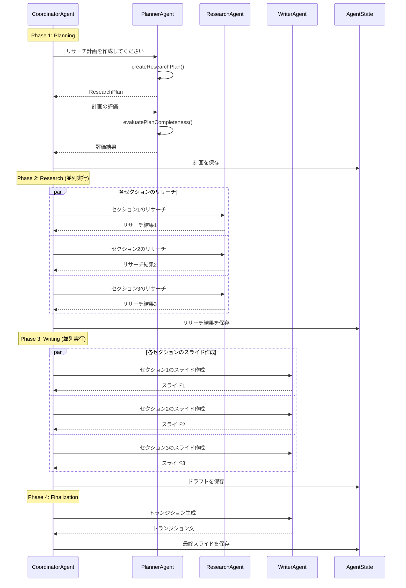
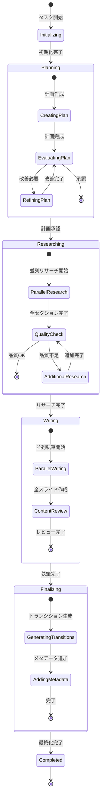
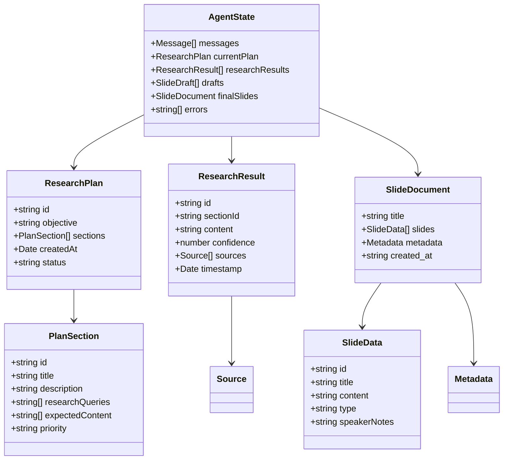
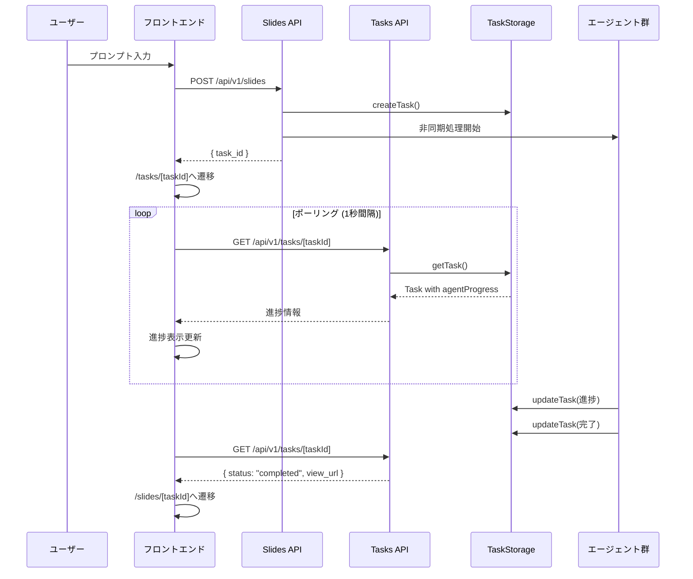

# AI Slide Generator - アーキテクチャ図

## システム全体のフロー

```mermaid
flowchart TB
    subgraph "フロントエンド"
        UI[ユーザーインターフェース]
        TP[タスク詳細ページ]
        APD[エージェント進捗表示]
    end

    subgraph "APIレイヤー"
        SA[Slides API<br/>/api/v1/slides]
        TA[Tasks API<br/>/api/v1/tasks/[taskId]]
        TS[タスクストレージ<br/>グローバルシングルトン]
    end

    subgraph "エージェントシステム"
        CA[CoordinatorAgent<br/>全体調整]
        PA[PlannerAgent<br/>計画立案]
        RA[ResearchAgent<br/>情報収集]
        WA[WriterAgent<br/>コンテンツ作成]
    end

    subgraph "外部サービス"
        OAI[OpenAI GPT-4o]
        PDF[PDFGenerator]
    end

    UI -->|プロンプト送信| SA
    SA -->|タスクID返却| UI
    UI -->|リダイレクト| TP
    TP -->|ポーリング| TA
    TA -->|進捗情報| APD
    
    SA --> TS
    TA --> TS
    
    SA -->|非同期処理| CA
    CA --> PA
    CA --> RA
    CA --> WA
    
    PA --> OAI
    RA --> OAI
    WA --> OAI
    
    CA -->|完成後| PDF
    PDF -->|保存| TS
```

## エージェント間の通信フロー



## エージェントの状態管理



## データ構造



## フロントエンドのコンポーネント構成

```mermaid
graph TB
    subgraph "ページコンポーネント"
        HP[Home Page<br/>/]
        TP[Task Detail Page<br/>/tasks/[taskId]]
        SP[Slide View Page<br/>/slides/[taskId]]
    end

    subgraph "UIコンポーネント"
        APD[AgentProgressDisplay]
        PB[ProgressBar]
        AS[AgentStatus]
        ML[MessageLog]
    end

    HP -->|タスク作成| TP
    TP --> APD
    APD --> PB
    APD --> AS
    APD --> ML
    TP -->|完了時| SP
```

## API通信フロー

